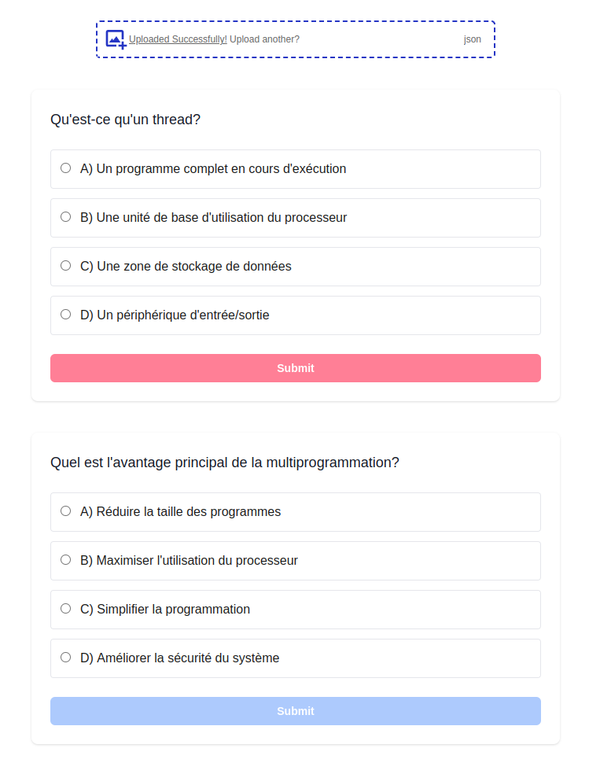

# Quizzer

- Display AI generated JSON MCQ.



### Running

```bash
npm run dev
```

Open [http://localhost:3000](http://localhost:3000) with your browser to see the result.

### Prompt

- The MCQ JSON file can be generated with the following prompt using [AI Studio](https://aistudio.google.com/) (Gemini 2.0 Flash):

```
You are a university professor preparing a multiple choice question exam using course notes.

Follow these instructions to create an exam question:
1. Generate a question based on the context as key "question"
2. Provide 4 multiple choice answers to the question as a list of key-value pairs "choices"
3. Provide the correct answer for the question from the list of answers as key "answer"
4. Provide an explanation as to why the answer is correct as key "explanation"

You must generate the questions in the language of the context.
You must respond as a JSON array with the following structure and the requested number of questions:
[{
    "question": "<question>",
    "choices": [
        {"key": "A", "value": "<choice>"},
        {"key": "B", "value": "<choice>"},
        {"key": "C", "value": "<choice>"},
        {"key": "D", "value": "<choice>"}
    ],
    "answer": "<answer key from choices list>",
    "explanation": "<explanation as to why the answer is correct>"
}]
```
